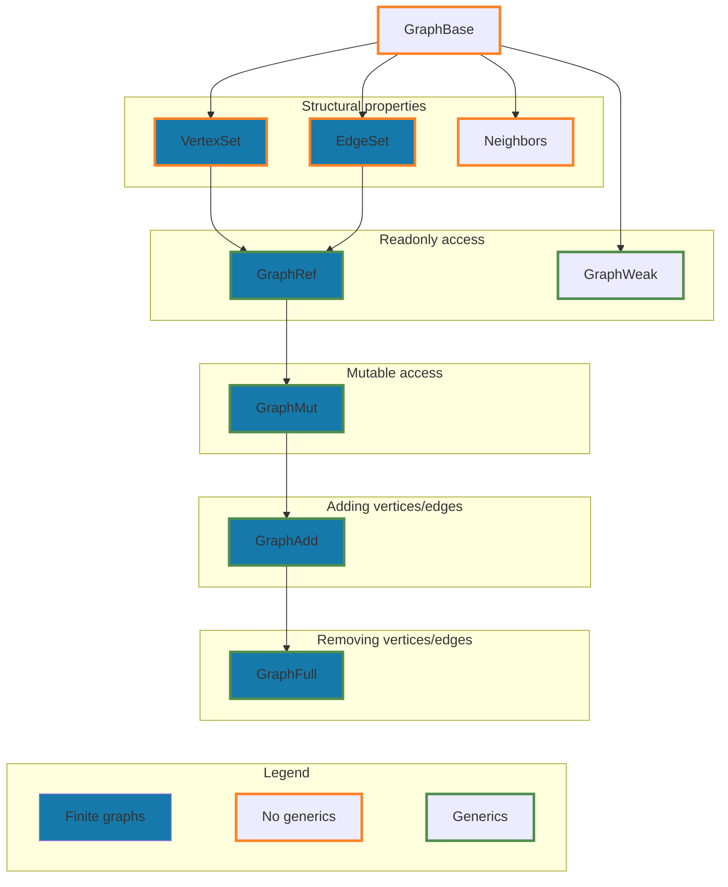

# Design

## Philosophy

### Convenience :handshake:

_Make the common case straightforward and natural. Avoid surprising behavior
leading to frustration. Support beginners in graph theory on their journey. All
this applies to the contributors too._

### Versatility :hammer:

_Offer simplicity as well as flexibility and strive for a good balance if in
conflict. Do not close the door on potential extensions. Unleash the fantasies
about all possible use cases and environments that we can support._

### Correctness :white_check_mark:

_Use extensive fuzzing and property-based testing to increase confidence about
correctness, because unit tests are not enough. Unsafe code is only the last
resort._

### Performance :fire:

_Write the code with performance and memory efficiency in mind. Design the
interfaces such that their implementations can be efficient or made so in the
future. Incorporate parallel algorithms._

## Mechanisms

_The following text is more like a vision than a description of the current
state of being. Some of the concepts are **implemented and under review**
( :mag: ) or under **construction** ( :construction: ), while others
are solely on a **wish list** ( :crystal_ball: )._

* [Problems instead of algorithms](#problems-instead-of-algorithms)
* [Builder pattern for algorithms](#builder-pattern-for-algorithms)
* [Separation of graph storage and semantics](#separation-of-graph-storage-and-semantics)
* [Graph access and manipulation interface](#graph-access-and-manipulation-interface)
* [Fuzzing](#fuzzing)
* [Statically guaranteed semantics](#statically-guaranteed-semantics)
* [Iteration over recursion](#iteration-over-recursion)
* [Parallel algorithms](#parallel-algorithms)

### Problems instead of algorithms

Users without much experience or knowledge in graph theory and algorithms may
feel intimidated and overwhelmed when seeing a long list of all algorithms
implemented by a library. It could be not obvious which algorithm should (or
even can) be used to solve given problem at hand, and in order to find that out
they need to consult the documentation or do their own research.

In gryf, the algorithms are organized into the problem they solve represented by
a single type ( :mag: ). So instead of exposing `dijkstra` and `bellman_ford`
functions, we have `ShortestPaths` type. Unless explicitly specified, the actual
algorithm used is even chosen by the library given the properties of the graph.
For instance, dijkstra algorithm is preferred, especially if there is a goal
vertex, but bellman ford is chosen when the edge weight can be negative
(dijkstra requires non-negative weights). The user does not need to care about
these "details".

This brings benefits on all our goals. It is very _convenient_ ( :handshake: ),
especially for a beginner, who does not (and should not) care about the actual
algorithm, as they only want a solution to their problem. Moreover, by getting a
value of specific type instead of a generic one such as `Vec` or `HashMap`, they
get an additional functionality (e.g., path reconstruction on [shortest
paths](https://en.wikipedia.org/wiki/Shortest_path_problem) or additional
queries like "is perfect?" on
[matching](https://en.wikipedia.org/wiki/Matching_(graph_theory))), which would
need to be coded manually otherwise. For gryf development, the convenience lies
mainly in the opportunity to tweak internals of the algorithms and outputs
without breaking the public API.

This abstraction has also many nice consequences in regards of _performance_
( :fire: ). First and foremost, there is an **automatic algorithm selection**,
which makes the decision based on the dynamic properties (e.g., vertex or edge
count) and static properties (e.g., graph being bipartite or connected, or edge
weight guaranteed to be positive) of the graph ( :mag: ). Second,
implementations of new, faster algorithms can be started to be used under the
hood so that the user gets better performance after update without any work on
their side.

Nevertheless, it is still possible to choose a specific algorithm. Therefore,
this organization does not prevent _versatility_ ( :hammer: ). The reasons why
enforcing an algorithm might be needed are these:

* The user knows for sure that the specific algorithm is the best option for
  their use case.
* The graph at hand lacks some features that are needed by the common entrypoint
  (which takes the union of requirements for the graph from all available
  algorithms), and the specific choice relaxes some of these constraints
  (enforced by traits).
* The specific algorithm provides an output that has richer API than the common
  entrypoint (which provides as much as each and every available algorithm can).

Regarding _correctness_ ( :white_check_mark: ), it is mainly about avoiding
misuse by the user. Automatic selection makes sure to choose an algorithm that
is supposed to work correctly on the graph given known properties (for example,
negative weights aware algorithm when weights are not guaranteed to be positive
or generic algorithm when graph is not guaranteed to have certain structural
properties). Rich API on the output also encourages user to use it instead of
implementing it on their own, which should avoid subtle bugs.

### Builder pattern for algorithms

Specifying arguments for algorithms is done using the builder pattern ( :mag: ).
This is _convenient_ ( :handshake: ) because the user does not need to deal with
optional parameters that they do not need/use. On the other hand, it also brings
_versatility_ ( :hammer: ) because the user _can_ specify these optional
parameters if it is useful/necessary for the situation. It is also valuable for
development of new capabilities, because new parameters can be added in a
backwards compatible way. As a concrete example, shortest path algorithm allows
to specify goal vertex, but `None` is used by default. In future, a heuristic
parameter builder method could be added for [heuristic-based
algorithms](https://en.wikipedia.org/wiki/A*_search_algorithm) without breaking
any existing code.

The general template for an algorithm builder is `on(&graph)` constructor,
followed by optional parameters, and ended with `run(self, required arguments)`
call which executes the algorithm. Having the `on(&graph)` constructor allows to
constrain builder methods based on the capabilities of given graph. This
improves error feedback (causing errors to be located right at the problematic
builder methods, not at the `run` method which is too late, making the cause
less obvious). For the same reason, all builder methods must specify all the
constraints that will be needed for running the algorithm. All this helps
_convenience_ ( :handshake: ) by leading to better error messages produced by
the compiler.

### Separation of graph storage and semantics

In gryf, high-level semantics provided by user-facing types are strictly
separated from the underlying storage/representation ( :mag: ). The graph data
can be stored in a
[common](https://en.wikipedia.org/wiki/Graph_(abstract_data_type)#Common_data_structures_for_graph_representation)
representation such as adjacency list or adjacency matrix, but it can as well be
stored in or represented by a custom, problem-tailored implementation, as long
as it implements provided interfaces. This helps _versatility_ ( :hammer: ), a
default storage might be fine in most cases, but where it truly matters the user
can choose whichever representation is most suitable given the
[trade-offs](https://en.wikipedia.org/wiki/Adjacency_list#Trade-offs). This idea
can be stretched to use cases where the representation wraps user's graph-like
data, encodes the structure
[implicitly](https://en.wikipedia.org/wiki/Implicit_graph) or happens to be in a
particular environment (e.g., embedded device or distributed system) ( :mag: ).

On top of a storage, there is an encapsulation with clear semantics. The most
general is a generic graph, but restricted forms include simple graph (without
parallel edges), path, bipartite graph and so on ( :construction: ). Each of
these encapsulations provide access and manipulation APIs that guarantee imposed
restrictions on the structure. A little _convenience_ ( :handshake: ) benefit is
that, in documentation, available API is listed and easily discoverable under
_Methods_ list, instead of hidden under _Trait Implementations_, which should
help newcomers.

Among the advantages of restricted semantics (tree, bipartite, ...) are:

* The type of graph clearly communicates the intention and structure.
* The API is limited such that it is impossible to make a graph that violates
  user-desired class of graph.
* For some problems, there exist (significantly) more efficient/less complicated
  algorithms for particular classes of graphs. Guaranteed property of a
  restricted graph can be utilized in choosing such an algorithm for better
  _performance_ ( :fire: ).

The separation also benefits the development as it allows to focus on limited
scope when implementing the encapsulation with specific semantics or the graph
storage, and not both at the same time. To some extent, it help to avoid _N x M_
implementations problem, where _N_ is the number of classes of graphs (path,
bipartite, ...) and _M_ is the number of graph representations.

### Graph access and manipulation interface

There are two extremes in regards of a graph interface: (a) single trait
covering everything, or (b) single trait per aspect/behavior. The goal is to
find the ~right spot on the spectrum. The core of the gryf's trait hierarchy
( :mag: ) is the following:

1. The _Structural properties_ level provides information about the graph's
   structure (graph size, queries like "contains vertex/edge", neighbors of a
   vertex, etc.). This level is already useful for graphs without attributes and
   hence has no generics representing the attributes.
2. The _Readonly access_ level brings the possibility to attach attributes to
   vertices and edges. We use the term _attributes_ instead of _weights_ here,
   because the values attached to vertices and edges can be of any type from
   which a weight can be "extracted" (using our `GetWeight` trait).
3. The _Mutable access_ level adds possibility to change the attributes in the
   graph, but not its structure.
4. The _Adding vertices/edges_ level unlocks the possibility to add new vertices
   and edges to the graph. Splitting this from the mutable access may be
   beneficial for semantic or practical reasons. For the former, there might be
   use case for fixed, predetermined graph of which the structure can't be
   changed, but the mutable access to attributes is still desired. For the
   latter, implementing the vertex/edge insertion is unnecessary effort if it's
   not useful for the use case.
5. The _Removing vertices/edges_ level is the final step for a full-fledged
   graph implementation. Separating insertion and removal is mainly practical,
   because implementing removal is usually even harder than insertion and is
   less common than building a graph from scratch.

One of the goals is to require only a core minimum of methods on these traits
and provide default implementations of others on top of that (similarly to what
standard traits like
[`Iterator`](https://doc.rust-lang.org/stable/std/iter/trait.Iterator.html) or
[`Read`](https://doc.rust-lang.org/stable/std/io/trait.Read.html) do). For
example, `replace_vertex(id)` can be expressed using `vertex_mut(id)` and
`mem::replace`; or `remove_edge_any_between(src, dst)` by combining
`edge_id_any(src, dst)` and `remove_edge(id)`. Sometimes, such default
implementation may be (significantly) inefficient, but must still be
semantically correct. To improve performance, the storage can provide overriding
implementations. This enables having wide API surface on the graph available
regardless of the storage, while keeping the requirements for the storage
implementation at minimum.

In order to preserve _versatility_ ( :hammer: ), we strictly separate traits
that are require finiteness of the graph and traits that don't. The latter could
be implemented by [implicit
graphs](https://en.wikipedia.org/wiki/Implicit_graph), which do not store the
structure and data explicitly, but produce them on demand instead.

### Fuzzing

Graphs are complicated data structures, especially if the implementation strives
to be efficient, and algorithms on them can be very complex with many corner
cases. For that reason, a high level of confidence in _correctness_ cannot be
achieved by using just unit tests. Instead, gryf heavily utilizes fuzzing and
property-based testing ( :white_check_mark: ).

There are two main areas for these testing techniques: _graph storages_ and
_algorithms_. These two require a little bit different approaches.

For graph storages, _fuzzing_ with [stateful
modeling](https://propertesting.com/book_stateful_properties.html) of graph
semantics is employed ( :construction: ). The idea is to generate sequences of
graph manipulating operations that are then applied on the graph. Crucially,
these include removing operations too. There are three levels of what fuzz
targets test:

1. The graph does not panic while applying the operation ( :mag: ).
2. The graph is in a consistent state after applying the operation ( :mag: ).
   See `check_consistency` function for details.
3. The graph exhibits the same behavior as a _model_ of graph semantics when
   applying the operation ( :construction: ). Such model is an implementation of
   the graph API, not necessarily efficient, which is simpler and easier to
   reason about, thus having higher confidence in correctness.

For algorithms, _property-based testing_ with fast and customizable generation
of the inputs graphs is used. The faster the generation is, the more inputs are
tested. Being able to customize the generation (acyclic, tree-like, ...) enables
to test more inputs which produce a valid output of an algorithm on which the
properties can be tested and not wasting cycles on inputs for which the
algorithm returns an error.

A considerable amount of effort was put into making the testing infrastructure
_convenient_ ( :handshake: ) for gryf developers. On a crash, fuzz targets print
Rust code that can be copy&pasted and ran in order to get almost complete,
copy&pastable reproduction as a unit test. Property-based tests try hard to
shrink the failing graphs into minimal reproducing examples and these are
printed in [Graphviz/DOT](https://graphviz.org/) language for immediate,
effortless visualization.

### Statically guaranteed semantics

The goal is to communicate various guarantees on graph semantics (such as being
loop-free or path) ( :construction: ). These can be then used in algorithms
(e.g., choosing a more efficient algorithm for bipartite graphs) ( :fire: ). In
order to minimize runtime performance penalty, these guarantees must be known
"statically". The properties must be either maintained by the graph type by
restricting the mutation, or determined dynamically just once when creating the
wrapper type.

The current mechanics for providing the guarantees about properties statically
is having traits with associated functions (not taking `self` as parameter) that
return boolean value. A nice thing is that the Rust compiler can often (always?)
optimize out the tests for these properties (e.g., in automatic algorithm
selection) thanks to monomorphization and dead code elimination.

See `Guarantee` trait ( :construction: ) or `Weight::is_unsigned` ( :mag: ) for
examples.

### Iteration over recursion

Iterative traversals are preferred over recursive traversals. The main advantage
is that iterative traversals are lazy, thus allowing to stop the traversal
without "hacking" the control flow semantics into callback's return type, and
can be "detached" from the graph so that the graph can be manipulated during
traversal (:handshake: :hammer:). Iterative traversal is also not limited by the
size of the program stack. However, in some cases this choice imposes an
efficiency penalty. See implementation of `RawDfsExtra` for the most notable
example.

The current implementation is split into ["raw" base](src/visit/raw.rs) and
high-level [wrappers](src/visit.rs) ( :mag: ). The raw base provides
implementations of fundamental types of traversal (BFS, a few variations on DFS)
( :construction: ), whereas the wrappers use them to offer variety of traversals
with different capabilities and semantics (BFS, DFS, DFS events, DFS without
backtracking, post order DFS). Raw base can also be used to implement
specialized traversals in algorithms.

### Parallel algorithms

Parallel algorithms exist for many problems in graph theory. Such algorithms can
significantly speed up getting the result, especially on large graphs ( :fire:
). The goal is to integrate parallel algorithms into the interface of gryf in a
seamless way ( :crystal_ball: ).
